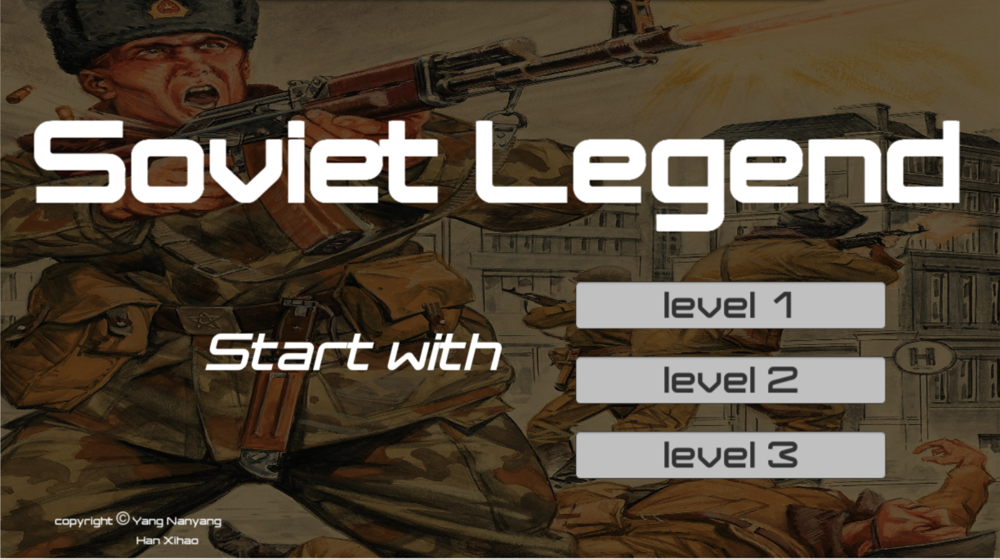
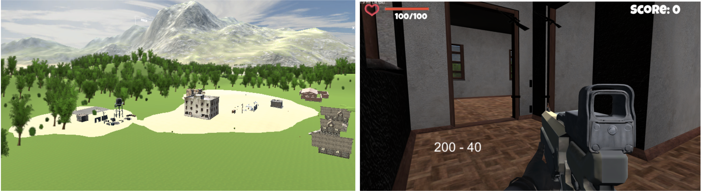
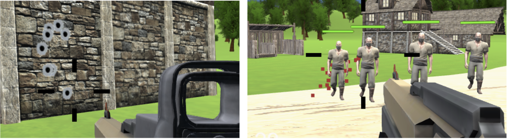

## IM2073 Unity Game - Soviet Legend

<b>Brief Description:</b>
Soviet Legend is a survival First Person Shooter (FPS) game where the player plays the role of a Soviet soldier Alexander. He is sent for a training in a remote training zone. There are in total three levels. After each level, he will receive a corresponding promotion. In the training, he will encounter strange enemies and monsters that would attack him and cause life damage to him. Soldier Alexander has two guns to shoot the enemies and receive certain scores accordingly if the enemies have been shot to death.
 
Once the score reaches the promotion line, he is promoted. However, if he is attacked until death by the enemies, he will then fail to be promoted.

This game consists of 4 types of scenes (Starting Dialogue, Game, Restart and Promotion).
 
Survival is the key!

<b>Game Objectives:</b>
* Player needs to avoid close contact with enemies and attack as many enemies as possible with guns.
* To stay alive by taking energy / blood supply on the floor.

<b>Features</b>
* Realistic Environmental setup
* Change of weapons
* Realtime UI status tracker
* Energy/Health supply mechanism
* Level setting for different stages
* Visual and audio effects of attack and player's movement
* Warning message and game dialogues

Birdview of the environment(left), interior setup of a building(right)

The main game view, with the gun in the center and the health bar and score at the top

The blood, bullet holes and firing effect

The full game source code can be found <a href="https://drive.google.com/file/d/1n_FDCk1v_RVvQhnO4CzgjvPJ8YlYhSrw/view?usp=sharing" >Here</a>
